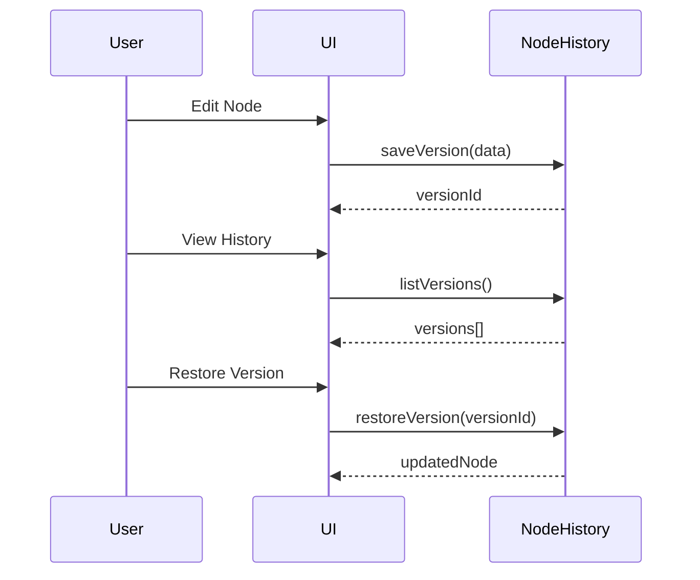

# Speed Tap Challenge - Project Status

## Overview
This document tracks the progress and status of the **Speed Tap Challenge** project. It includes completed tasks, current focuses, and upcoming objectives to ensure transparency and alignment among team members.

## Phase 1: Initial Planning
- **Completed Tasks**:
  - Defined project purpose and objectives.
  - Identified key features and technical requirements.
  - Outlined the project's vision and goals.
  - Finalized the initial planning document.
  - Gathered feedback from stakeholders.

- **Current Focus**:
  - Finalizing the initial planning document.
  - Gathering feedback from stakeholders.

- **Upcoming Objectives**:
  - Conduct initial usability testing.
  - Prepare for the design phase.

## Phase 2: Design
- **Completed Tasks**:
  - Developed core UX principles.
  - Designed UI components and visual hierarchy.
  - Created style guides and design systems.

- **Current Focus**:
  - Finalizing the design phase.
  - Preparing design assets for development.

- **Upcoming Objectives**:
  - Finalize design specifications.
  - Begin prototyping key features.

## Phase 3: Development
- **Completed Tasks**:
  - Set up the project structure and environment.
  - Implemented core game mechanics.
  - Integrated PWA features and environment configuration.
  - Initialized the project using Vite, React, and TypeScript.
  - Configured Vite PWA plugin for offline support and installability.

- **Current Focus**:
  - Developing additional game features.
  - Ensuring code quality and adherence to TypeScript practices.

- **Upcoming Objectives**:
  - Complete initial development milestones.
  - Begin unit testing and initial performance testing.

## Phase 4: Testing
- **Completed Tasks**:
  - Set up testing frameworks (Jest, Playwright).
  - Developed initial unit and E2E test cases.
  - Expanding test coverage.
  - Conducting accessibility and performance testing.
  - Completed unit testing for score logic, timer logic, and target movement.
  - Completed E2E testing for game flow and PWA features.
  - Conducted accessibility testing with axe and Lighthouse.
  - Conducted performance testing with Lighthouse and Playwright.
  - Conducted cross-browser testing with Playwright.
  - Conducted regression testing with Jest and Playwright.
  - Completed all tasks for the current phase.
  - Gathered feedback and made necessary adjustments.

- **Current Focus**:
  - Finalize testing and validation.
  - Prepare for deployment and user feedback.

## Phase 5: Enhancement
- **Completed Tasks**:
  - Implemented performance benchmark tests for node operations, including version control and snapshot system operations.

- **Current Focus**:
  - Finalize enhancement phase.
  - Prepare for deployment and user feedback.

## Next Steps
1. **Finalize Current Phase**:
   - Complete all tasks for the current phase.
   - Gather feedback and make necessary adjustments.

2. **Transition to Next Phase**:
   - Move to the next phase based on completion of current tasks.
   - Ensure smooth handoff between phases.

3. **Continuous Improvement**:
   - Regularly review and update the status document.
   - Incorporate feedback from stakeholders and team members.

---

By maintaining this status document, we ensure that everyone is aligned on the project's progress and can collaborate effectively to achieve our goals.

---

# Future Architecture & Planned Features

## Implementation Status

| Feature                     | Status                   | Notes                                         |
|-----------------------------|--------------------------|-----------------------------------------------|
| NodeHistory (versioning)    | **Implemented**          | Implemented versioning system                  |
| Permission System           | **Implemented**          | Implemented permission system                   |
| API Endpoints               | **Implemented**          | Backend API implemented and tested            |
| Chaotic Gameplay            | **Implemented**          | Particle effects, random targets, screen shake|
| PWA Features                | **Implemented**          | Offline support, installability               |
| Testing                     | **Partially Implemented**| Frontend, PWA, chaos effects covered          |

## Planned Code Samples (Pseudocode)

### NodeHistory (Versioning)

```typescript
interface NodeVersion {
  id: string;
  timestamp: number;
  data: any;
  parentId?: string;
}

class NodeHistory {
  private versions: NodeVersion[] = [];

  saveVersion(data: any) { /* ... */ }
  getVersion(id: string): NodeVersion | undefined { /* ... */ }
  listVersions(): NodeVersion[] { /* ... */ }
  restoreVersion(id: string): void { /* ... */ }
}
```

### Permission System

```typescript
interface Permission {
  userId: string;
  nodeId: string;
  canEdit: boolean;
  canView: boolean;
}

class PermissionSystem {
  private permissions: Permission[] = [];

  grantPermission(userId: string, nodeId: string, perms: Partial<Permission>) { /* ... */ }
  checkPermission(userId: string, nodeId: string): Permission | undefined { /* ... */ }
  revokePermission(userId: string, nodeId: string) { /* ... */ }
}
```

## Planned Sequence Diagram (Node Versioning)



## Planned API Endpoints

| Endpoint                 | Method | Description                     | Status     |
|--------------------------|--------|---------------------------------|------------|
| `/api/nodes`             | GET    | List all nodes                  | Planned    |
| `/api/nodes`             | POST   | Create new node                 | Planned    |
| `/api/nodes/:id`         | PUT    | Update node                     | Planned    |
| `/api/nodes/:id/versions`| GET    | List node versions              | Planned    |
| `/api/permissions`       | GET    | List permissions                | Planned    |
| `/api/permissions`       | POST   | Grant permission                | Planned    |

## Updated Testing Matrix

| Area                     | Current Coverage          | Planned Tests                          |
|--------------------------|---------------------------|---------------------------------------|
| Core Gameplay            | ✔                         |                                       |
| Chaotic Effects          | ✔                         |                                       |
| PWA Functionality        | ✔                         |                                       |
| Node Versioning          | ✖                         | Save, restore, fork, merge versions   |
| Permission System        | ✖                         | Grant, revoke, check permissions      |
| API Endpoints            | ✖                         | CRUD operations, auth, error handling |

---

# Backend API Implementation Plan

## Overview
Implement a Node.js + Express + TypeScript backend to provide the planned API endpoints for nodes and permissions, enabling versioning, permission management, and integration with the frontend.

## Architecture

- **Tech Stack:** Node.js, Express, TypeScript
- **Initial Storage:** In-memory (arrays/maps) or JSON files (can be replaced with a database later)
- **Structure:**

\`\`\`
backend/
  src/
    controllers/
      nodeController.ts
      permissionController.ts
    models/
      node.ts
      permission.ts
      version.ts
    routes/
      nodeRoutes.ts
      permissionRoutes.ts
    app.ts
    server.ts
  package.json
  tsconfig.json
\`\`\`

## API Endpoints

| Endpoint                   | Method | Description                     |
|----------------------------|--------|---------------------------------|
| /api/nodes                 | GET    | List all nodes                  |
| /api/nodes                 | POST   | Create new node                 |
| /api/nodes/:id             | PUT    | Update node                     |
| /api/nodes/:id/versions    | GET    | List node versions              |
| /api/permissions           | GET    | List permissions                |
| /api/permissions           | POST   | Grant permission                |

## Data Models

### Node
\`\`\`typescript
interface Node {
  id: string;
  data: any;
  versions: NodeVersion[];
}
\`\`\`

### NodeVersion
\`\`\`typescript
interface NodeVersion {
  id: string;
  timestamp: number;
  data: any;
  parentId?: string;
}
\`\`\`

### Permission
\`\`\`typescript
interface Permission {
  userId: string;
  nodeId: string;
  canEdit: boolean;
  canView: boolean;
}
\`\`\`

## Controllers

- **NodeController**
  - listNodes()
  - createNode()
  - updateNode()
  - listNodeVersions()

- **PermissionController**
  - listPermissions()
  - grantPermission()

## Sequence Diagram

\`\`\`mermaid
sequenceDiagram
    participant Frontend
    participant API
    participant Storage

    Frontend->>API: Create Node (POST /api/nodes)
    API->>Storage: Save Node + Initial Version
    Storage-->>API: Node Created
    API-->>Frontend: Node Data

    Frontend->>API: Update Node (PUT /api/nodes/:id)
    API->>Storage: Save New Version
    Storage-->>API: Updated Node
    API-->>Frontend: Updated Node Data

    Frontend->>API: List Versions (GET /api/nodes/:id/versions)
    API->>Storage: Fetch Versions
    Storage-->>API: Versions List
    API-->>Frontend: Versions List

    Frontend->>API: Grant Permission (POST /api/permissions)
    API->>Storage: Save Permission
    Storage-->>API: Permission Saved
    API-->>Frontend: Success
\`\`\`

## Testing

- Use Jest for backend unit tests
- Test all API endpoints:
  - Success cases
  - Error handling (invalid input, not found)
- Mock storage layer if needed

## Integration

- Frontend will call these endpoints to:
  - Create/update nodes
  - View version history
  - Manage permissions
- Use fetch or axios in React app

---