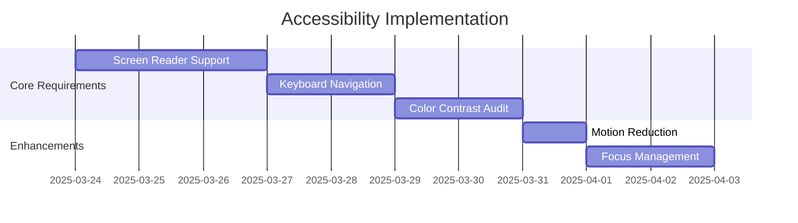
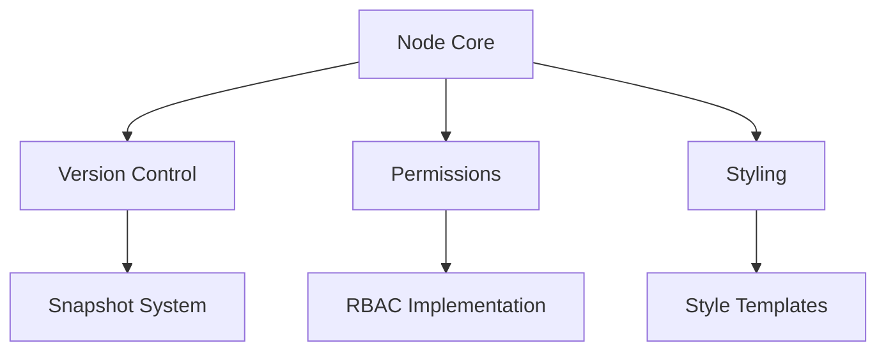

# Speed Tap Challenge - Feature Implementation Plan

## UI/UX Improvements Roadmap

### 1. Accessibility (P0)


### 2. Node Management System


### 3. Implementation Phases

| Phase | Features | Owner | Status |
|-------|----------|-------|--------|
| Foundation | Accessibility Core, Basic Undo/Redo | UX Team | Planned |
| Node V1 | Versioning, Style Templates | Core Dev | In Progress |
| Collaboration | Locking, Permissions | Backend | Backlog |
| Analytics | Usage Tracking, Metrics | Data Team | Specing |

## Technical Specifications

### Node Versioning
```ts
interface NodeHistory {
  versions: Array<{
    timestamp: string
    hash: string
    snapshot: NodeSnapshot
  }>
  currentVersion: number
  maxHistory: 50
}
```

### Permission System
```ts
type AccessLevel = 'view' | 'edit' | 'admin'
type NodeACL = Record<string, AccessLevel>

const nodePermissions: NodeACL = {
  'user:123': 'edit',
  'group:designers': 'view'
}
```

## Testing Requirements
- [x] Accessibility audits using axe-core
- [x] Keyboard navigation tests
- [x] Screen reader compatibility tests
- [x] Performance benchmarks for node operations